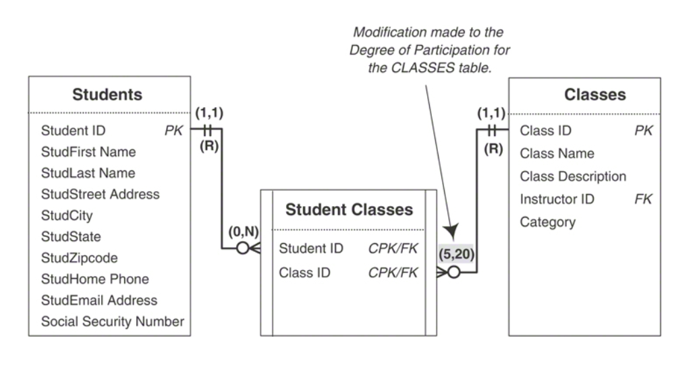

# database-design
Guide to relational database design

## Summary

* Perceived the advantages of the relational database model and how it compares to other database models
* Created a mission statement for a new database
* Defined mission objectives for the new database
* Performed a complete analysis of an old database
* Identified the organization’s information requirements
* Defined all the appropriate table structures
* Assigned a primary key to each table
* Established field specifications for each field
* Established table relationships
* Defined and established business rules
* Defined all the appropriate views
* Established overall data integrity
* In every steps, should interview and working with users

## Refining Data Integrity

### Table-Level Integrity

* No duplicate fields exist in the table.
* No calculated fields exist in the table.
* No multivalued fields exist in the table.
* No multipart fields exist in the table.
* No duplicate records exist in the table.
* Every record in the table is identified by a primary key value.
* Each primary key conforms to the Elements of a Primary Key.

### Field-Level Integrity

* Made sure each field conforms to the Elements of the Ideal Field
* Made certain you’ve defined a set of field specifications for each field

### Relationship-Level Integrity

* Properly established the relationship: The connection between the two tables (or key fields) in a relationship is sound. You accomplished this by using primary and foreign key fields to establish a one-to-one or a one-to-many relationship and a linking table to establish a many-to-many relationship.
* Defined the appropriate deletion rules: You can insert new records into each table in a meaningful manner. You ensured this by designating the appropriate type of participation for each table (or key field) within the relationship. You can delete an existing record without producing any adverse effects. You guaranteed this by assigning an appropriate deletion rule for the relationship.
* Correctly identified the type of participation for each table: Mandatory or Optional
* Established the proper degree of participation for each table: A meaningful limit exists for the number of records that can be interrelated within the relationship. You implemented this by designating the appropriate degree of participation for each table (or key field) within the relationship.

#### Many-to-Many

\
\
Creating a linking table produces a few noteworthy results:

* The original many-to-many relationship has been dissolved because a direct relationship no longer exists between the STUDENTS and CLASSES tables. The original relationship has been replaced by two one-to-many relationships: one between STUDENTS and STUDENT CLASSES and another between CLASSES and STUDENT CLASSES. In the first relationship, a single record in STUDENTS can be associated with one or more records in STUDENT CLASSES, but a single record in the STUDENT CLASSES table can be associated with only one record in STUDENTS. In the second relationship, a single record in the CLASSES table can be associated with one or more records in STUDENT CLASSES, but a single record in STUDENT CLASSES can be associated with only one record in CLASSES.
* The STUDENT CLASSES linking table contains two foreign keys. STUDENT ID and CLASS ID are both copies of the primary keys from the STUDENTS and CLASSES tables, respectively; therefore, each is a foreign key by definition. As such, they help to establish the relationship between their parent tables and the linking table.
* The STUDENT CLASSES linking table has a composite primary key composed of the Student ID and Class ID fields. Except in rare instances, a linking table always contains a composite primary key. (This rule applies to the database’s logical design only. There are various reasons why you might break this rule when you transform the logical design into a physical design, but this is a discussion that is beyond the scope of this book.) It’s important to note that you’ll occasionally have to add more fields to the linking table to guarantee a unique primary key value. For example, assume the school decides to record student schedules for every term of the school year (fall, winter, and spring). You would have to add a new field, perhaps called TERM, and designate it as part of the composite primary key. This would enable you to enter another instance of a given student and class into the table, but for a different term; a student may need to retake a class during the spring term because he failed the class in the fall term.
* The linking table helps to keep redundant data to an absolute minimum. There is no superfluous data in this table at all. In fact, the main advantage of this table structure is that it allows you to enter as few or as many classes for a single student as are necessary. Later in the database design process, you’ll learn how to create views to draw the data from these tables together to present it as meaningful information.
* The name of the linking table reflects the purpose of the relationship it helps establish. The data stored in the STUDENT CLASSES table represents a student and the classes in which he or she is enrolled.

#### Many-to-Many (Self-referencing)

\
\

### Business Rules

* You’re sure that each rule imposes a meaningful constraint.
* You’ve determined the proper category for the rule.
* You’ve properly defined and established each rule.
* You’ve modified the appropriate field specification elements or table relationship characteristics.
* You’ve established the appropriate validation tables.
* You’ve completed a Business Rule Specifications sheet for each rule.

\
\
A student cannot have more than two instruments checked out at the same time.

\
\
Each class must have a minimum of five students, but cannot have more than 20.

#### Test the Rule

* Will this rule be violated if I enter a new record into this table?
* Will this rule be violated if I do not enter a new record into this table?
* Will this rule be violated if I delete a record from this table?
* Will this rule be violated if I enter a value into this field?
* Will this rule be violated if I do not enter a value into this field?
* Will this rule be violated if I update the value of this field?
* Will this rule be violated if I delete the value of this field?

### Views

* Each view is built on the base tables necessary to provide the required information.
* You’ve assigned the appropriate fields to each view.
* Each calculated field provides pertinent information or enhances the manner in which the view presents its data.
* Each filter returns the appropriate set of records.
* Each view has a view diagram.
* Each view diagram is accompanied by a View Specifications sheet.

## Assembling the Database Documentation

Throughout the database design process, you’ve generated a number of lists, specification sheets, and diagrams used to record various aspects of the database design. You should now assemble them into a central repository, preferably in a set of binders or in an organized set of folders and files on a computer. The design repository should consist of the following sets of documents:

* Final table list
* Field Specifications sheets
* Calculated field list
* Table structure diagrams
* Relationship diagrams
* Business Rule Specifications sheets
* View diagrams
* View Specifications sheets

Two additional sets of items you may consider keeping with this documentation are the notes you compiled during the design process and the samples you gathered during the analysis stage of the design process. You can keep each of these items in a separate appendix at the end of the documentation.\
\
All of these items constitute the complete set of documentation for the logical design of the database. This documentation is vital for three reasons.

1. It provides a complete record of the database structure. You can find every aspect of the logical structure of the database within the documentation. Additionally, you can answer almost any question concerning the database simply by referring to the documentation.
1. It provides a complete set of specifications and instructions on how the database should be created during the implementation process. This documentation is similar to an architect’s blueprints: It indicates how the database is to be constructed. It also identifies the integrity that needs to be established for the database. Because the database design is not directed to a particular RDBMS, the individuals implementing the database have full latitude concerning the manner in which they physically implement the database.
1. Should it seem necessary to modify the database structure during the implementation process, the design documentation can be used to determine the effects and consequences of any modifications. Any modifications you make to the database structure should be the result of an informed decision. You can make certain that a proposed modification will not have an adverse effect on the database structure by referencing the documentation first.

### Table-Level Integrity

## Bad Design—What Not to Do

### “Flat-File” Design

sometimes known as the “throw-everything-into-one-big-table” design

### Spreadsheet Design

Something that already aggregate, and just for beautiful display

## Database Design Based on the Database Software

An RDBMS does not provide a basis or procedure or even a reason for designing a database in a particular fashion: It only provides the tools that you need to implement a design. In contrast, a formal database design method provides both the principles and rationale necessary to define a database properly and effectively.\
\
Many people unwittingly fall into the trap of designing a database based solely on the RDBMS software they will use for its implementation. In many cases, they do so because they are already somewhat familiar and skilled with a particular RDBMS or their company or organization is already using a particular RDMBS. This is an unwise approach that you should avoid (as much as possible) for several reasons:

* You’re likely to make design decisions based on your perceptions of what your RDBMS can or can’t do. For example, you may decide not to impose a degree of participation for a given relationship because you believe the RDBMS does not provide you with the means to do so.
* You’ll inadvertently let the RDBMS dictate the design of the database as opposed to driving the design strictly from the organization’s information requirements. This usually occurs when you discover that your RDBMS provides only limited support for certain aspects of the database, such as field specifications and relationship characteristics.
* Your design will be constrained by your knowledge of the RDBMS. For example, you may decide not to implement relationship characteristics simply because you don’t know how to do so.
* Your design will be constrained by how skilled you are with your RDBMS. Your skill level affects how efficiently and effectively you can implement various aspects of the database, such as field specifications and business rules.
* Using this approach to design a database commonly results in improper structural design, insufficient data integrity, and problems with inconsistent data and inaccurate information. Defining a database within an RDBMS can be deceptively easy. You may create a database that works, but you’re very likely to have a poor design without knowing it.
* In the end, the RDBMS that you know and love so well may not be suitable for your organization’s database requirements.

You should always design the logical structure of your database without regard to any RDBMS. By doing so, you’re more likely to design a sound structure because you’ll be focused on the organization’s information requirements. After your design is complete, you can then clearly determine how you should implement the database (single-user application, client/server, web-based, and so on) and which RDBMS you should use to facilitate the implementation.

## Interview Process (The first of everything)

Here are a few sample questions that you can use to arrive at your mission statement:

* How would you describe the purpose of your organization to a new client?
* What would you say is the purpose of your organization?
* What is the major function of your organization?
* How would you describe what your organization does?
* How would you define the single most important reason for the existence of your organization?
* What is the main focus of your organization?
* What kind of work do you perform on a daily basis?
* How would you define your job desription?
* What kind of data do you work with?
* What types of reports do you generate?
* What types of things do you keep track of?
* What types of services does your organizationprovide?
* How would you describe the type of work you do
